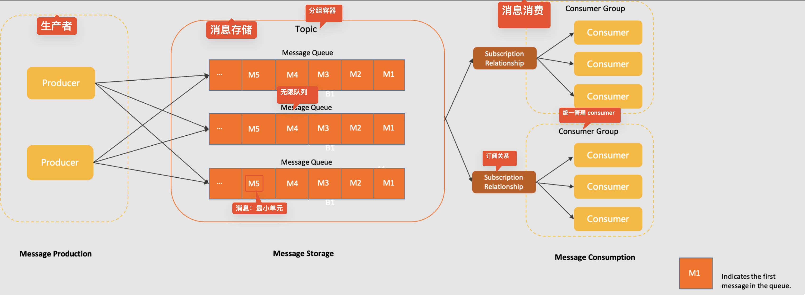
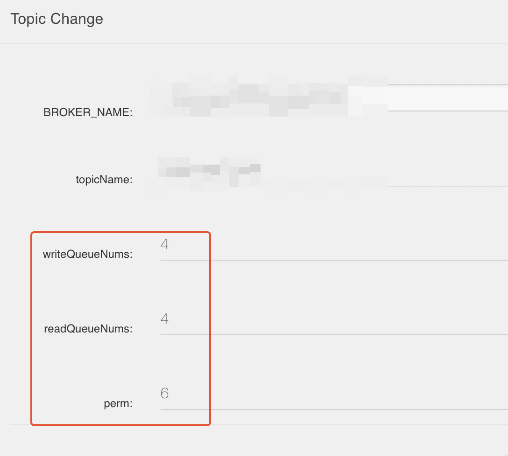
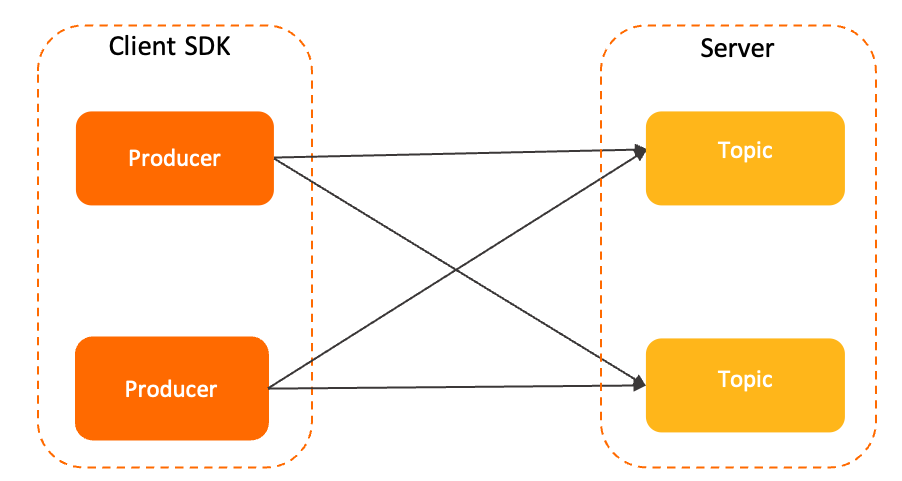
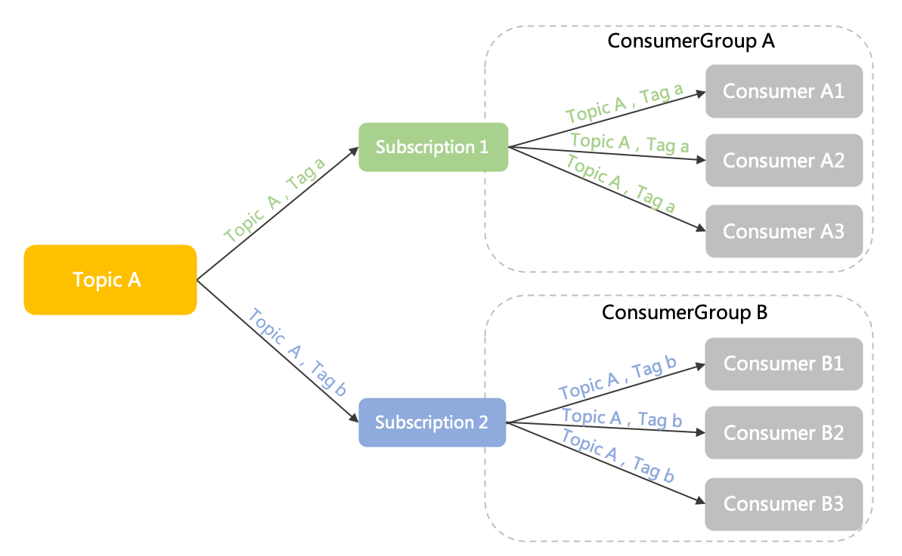
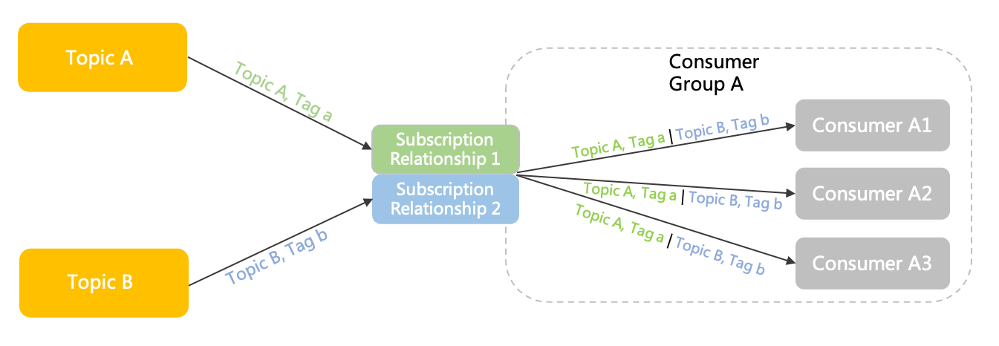
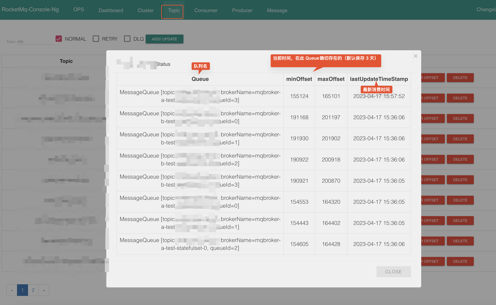
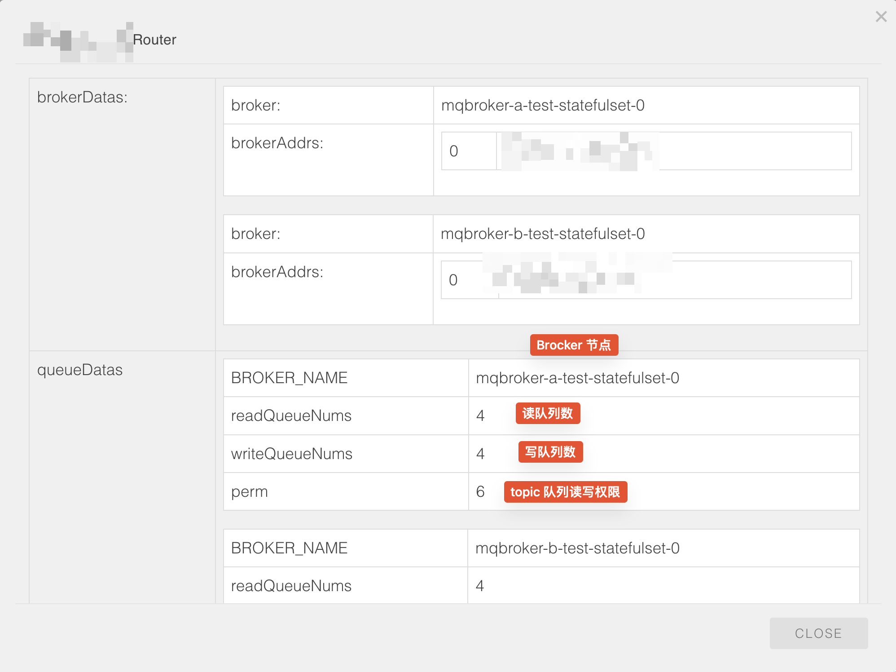
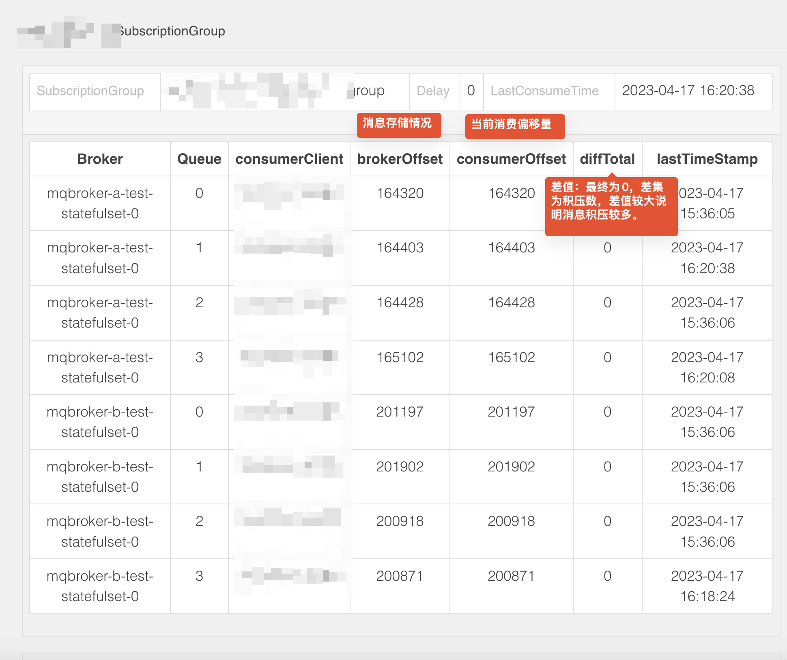
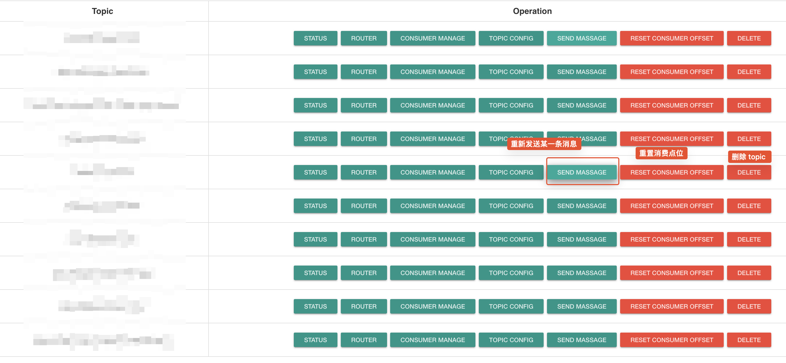

## 背景
公司进行了巨大的组织调整，被迫接手了一些中间件，为了能以后更好的展开工作和维护，整体过了一下 RocketMq 的文档，结合实际场景，记录一些要点。

<!--more-->## 架构
Producer、Topic、Queue、Consumer Group、Consumer 之间的关系：

### Topic
- Normal: 普通消息（大部分场景）

- FIFO：先进先出，严格按照投递顺序（数据同步场景）

- Delay：延时消息（补偿/定时 查询）

- Transaction：事物消息

### Queue
消息操作是面向 topic，实际数据是由 Queue 承接的，通过增加 Queue 数量以此实现水平扩容。

perm 权限：

- 6 读写状态

- 4 只读状态

- 2 只写状态

- 0 不可读写

### Message
Message 消息不可变、默认持久化，存储在当前 Queue，携带：

- 消息点位（ **RocketMq** 生成的 **consumerOffset** 记录消费位置）

- 消息 ID （全局唯一）

- Key（快速索引，用于控制台）

- Tag（ **Producer** 决定）

- 时间戳（Delay 场景， **Producer** 决定，最大 30 day）

- 消息发送时间（客户端本地时间戳）

- 消息保存时间（服务端本地时间戳，可以结合消息发送时间排查一些本体延迟问题）

- 消费重试次数（每次 retry，次数 +1，兜底策略）

- 消息体约束（普通 & 顺序：4M，事物 & 定时 & 延时：64k）

 **消费重试策略概述** 

消费重试指的是，消费者在消费某条消息失败后，Apache RocketMQ 服务端会根据重试策略重新消费该消息，超过一次定数后若还未消费成功，则该消息将不再继续重试，直接被发送到死信队列中。

 **重试次数** 

假设最大重试次数为默认 3 次，则该消息最多可被投递4次，1次为原始消息，3次为重试投递次数。由消费者分组创建时的元数据控制。

| 第几次重试 | 与上次重试的间隔时间 | 第几次重试 | 与上次重试的间隔时间 |
| --- | --- | --- | --- |
| 1 | 10秒 | 9 | 7分钟 |
| 2 | 30秒 | 10 | 8分钟 |
| 3 | 1分钟 | 11 | 9分钟 |
| 4 | 2分钟 | 12 | 10分钟 |
| 5 | 3分钟 | 13 | 20分钟 |
| 6 | 4分钟 | 14 | 30分钟 |
| 7 | 5分钟 | 15 | 1小时 |
| 8 | 6分钟 | 16 | 2小时 |
<!--more--> **重试触发条件：** 

- 消费失败，包括消费者返回消息失败状态标识或抛出非预期异常。

- 消息处理超时，包括在 PushConsumer 中排队超时。

### Producer

###  **ConsumerGroup** 
消费者分组并不是运行实体，而是一个逻辑资源，通过消费者分组内初始化多个消费者实现消费性能的水平扩展以及高可用容灾。

要求同一分组下的所有消费者以下消费行为保持一致：

-  **投递顺序** 

-  **消费重试策略** 

### Consumer
支持 PushConsumer 、 SimpleConsumer 以及 PullConsumer 这三种类型的消费者

| 对比项 | PushConsumer | SimpleConsumer | PullConsumer |
| --- | --- | --- | --- |
| 接口方式 | 使用监听器回调接口返回消费结果，消费者仅允许在监听器范围内处理消费逻辑。 | 业务方自行实现消息处理，并主动调用接口返回消费结果。 | 业务方自行按队列拉取消息，并可选择性地提交消费结果 |
| 消费并发度管理 | 由SDK管理消费并发度。 | 由业务方消费逻辑自行管理消费线程。 | 由业务方消费逻辑自行管理消费线程。 |
| 负载均衡粒度 | 5.0 SDK是消息粒度，更均衡，早期版本是队列维度 | 消息粒度，更均衡 | 队列粒度，吞吐攒批性能更好，但容易不均衡 |
| 接口灵活度 | 高度封装，不够灵活。 | 原子接口，可灵活自定义。 | 原子接口，可灵活自定义。 |
| 适用场景 | 适用于无自定义流程的业务消息开发场景。 | 适用于需要高度自定义业务流程的业务开发场景。 | 仅推荐在流处理框架场景下集成使用 |
<!--more-->关于三种详细的差别细节：[消费者分类 | RocketMQ (apache.org)](https://rocketmq.apache.org/zh/docs/featureBehavior/06consumertype)

### Subscription
一个订阅关系指的是指定 **某个消费者** 分组对于 **某个主题** 的订阅

不同消费组，订阅同一个 Topic ，互为两个订阅关系，相互独立：

同一消费组订阅不同 Topic ，互为两个订阅关系，相互独立：

## 最佳实践：
### Tag
一个应用尽可能用一个Topic，而消息子类型则可以用tags来标识。tags可以由应用自由设置，只有生产者在发送消息设置了tags，消费方在订阅消息时才可以利用tags通过broker做消息过滤

### Keys
每个消息在业务层面一般建议映射到业务的唯一标识并设置到keys字段，方便将来定位消息丢失问题。服务器会为每个消息创建索引（哈希索引），应用可以通过topic、key来查询这条消息内容，以及消息被谁消费。由于是哈希索引，请务必保证key尽可能唯一

### 业务日志
消息发送成功或者失败要打印消息日志，用于业务排查问题。Send消息方法只要不抛异常，就代表发送成功。

###  **消息发送失败处理方式** 
如果业务要求消息发送不能丢，仍然需要对可能出现的异常做兜底，比如调用send同步方法发送失败时，则尝试将消息存储到db，然后由后台线程定时重试，确保消息一定到达Broker。

### 消费者幂等
在消费之前判断唯一键是否在关系数据库中存在。如果不存在则插入，并消费，否则跳过。（实际过程要考虑原子性问题，判断是否存在可以尝试插入，如果报主键冲突，则插入失败，直接跳过）

###  **提高消费并行度** 
- 增加 Consumer（加机器）

- 提高单个 Consumer 的消费并行线程，5.x PushConsumer SDK 可以通过PushConsumerBuilder.setConsumptionThreadCount() 设置线程数，SimpleConsumer可以由业务线程自由增加并发，底层线程安全；

- 建议使用5.x SDK的SimpleConsumer，每次接口调用设置批次大小，一次性拉取消费多条消息，多线程消费

###  **RocketMQ Connect** 
类似 kafka Connecter 的 sink 组件，各种外部数据之间的传输 & 转换，EG:

- Mysql 数据同步 ES

- PR 同步 influxDB

目前性能最好最稳定组件最多的是 Kafka，rocketMq 不用考虑这个。

## FAQ：
- 如何重置消费点位

    - [消费进度管理 | RocketMQ (apache.org)](https://rocketmq.apache.org/zh/docs/featureBehavior/09consumerprogress)

<!--more-->-  **订阅关系不一致的排查** 

    - [订阅关系一致 | RocketMQ (apache.org)](https://rocketmq.apache.org/zh/docs/bestPractice/05subscribe)

<!--more-->- 创建新的 ConsumerGroup 从哪里开始消费

    - 3.x/4.x SDK 则比较复杂，如果首次启动是在发送的消息在三天之内，那么消费者会从服务器中保存的第一条消息开始消费；如果发送的消息已经超过三天，则消费者会从服务器中的最新消息开始消费，也就是从队列的尾部开始消费。再次重新启动后，会从最后一次的消费位置继续消费。

<!--more-->-  **当消费失败的时候如何重新消费消息？** 

    - 在集群模式下，消费的业务逻辑代码会返回消费失败状态，或者抛出异常，如果一条消息消费失败，则会按照设置的最大重试次数重试，之后该消息会被丢弃。

<!--more-->    - 在广播消费模式下，广播消费仍然保证消息至少被消费一次，但不提供重发的选项。

-  **消息在服务器上可以保存多长时间？** 

    - 默认 3 天

<!--more-->- 常见错误码原因 & 解决方案

    - [常见问题解答 | RocketMQ (apache.org)](https://rocketmq.apache.org/zh/docs/bestPractice/06FAQ#4-%E9%94%99%E8%AF%AF)

<!--more-->

## 控制台排查问题指南

